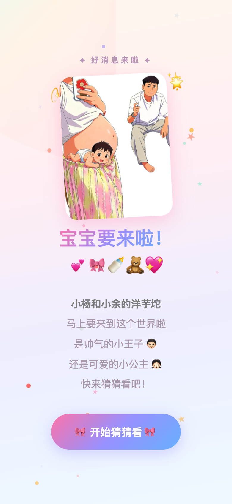

# 🍼 宝宝性别竞猜 / Baby Gender Guess

[中文](#中文) | [English](#english)

---

<a id="中文"></a>

一个有趣、极简的 Web 小应用 —— 让朋友们猜猜宝宝是男是女，还能留下祝福！

 

🎉 原版已在真实的宝宝性别揭晓派对上使用过！




## ✨ 功能特点

- 🗳️ **投票** — 男孩还是女孩？每人一票（可改投）
- 📊 **实时统计** — 投票数量和比例实时更新
- 💬 **祝福墙** — 朋友们可以给宝宝留言祝福
- 🔒 **管理员揭晓** — 用密钥设置答案，揭晓结果
- 📱 **手机友好** — 简洁响应式设计
- ⚡ **零依赖** — 纯 Node.js，无需任何框架

## 🚀 快速开始

```bash
# 克隆项目
git clone https://github.com/yang4115333/baby-gender-guess.git
cd baby-gender-guess

# 准备数据文件
cp votes.example.json votes.json
cp blessings.example.json blessings.json
cp answer.example.json answer.json

# 设置管理员密钥（可选，默认为 "change-me"）
export ADMIN_TOKEN="your-secret-token"

# 启动
node server.js
```

打开 `http://localhost:8899` 🎉

## 🔧 工作原理

- **投票：** POST `/api/vote`，参数 `{ name, vote: "boy"|"girl" }`
- **统计：** GET `/api/stats` 返回投票数据和答案（揭晓后）
- **祝福：** POST `/api/blessing` 提交祝福 / GET `/api/blessings` 获取列表
- **揭晓：** POST `/api/reveal`，参数 `{ answer: "boy"|"girl", token: "..." }`

所有数据存储在 JSON 文件中，无需数据库。

## 🎨 自定义

- 替换 `public/hero-placeholder.svg` 为你自己的宝宝照片
- 编辑 `public/index.html` 修改颜色、文字和样式
- 通过环境变量 `ADMIN_TOKEN` 设置管理员密钥

## 🚢 部署

支持 Nginx、Caddy、Cloudflare Tunnel 等反向代理。

```bash
# 示例：在 8899 端口运行
ADMIN_TOKEN=mytoken node server.js
```

## 📄 许可证

MIT

---

<a id="english"></a>

# 🍼 Baby Gender Guess

A fun, minimalist web app for friends to guess the gender of an upcoming baby — and leave blessings!

 

**Live Demo:** The original instance was used for a real baby gender reveal party 🎉


## Features

- 🗳️ **Vote** — Boy or Girl? One vote per name (can re-vote to change)
- 📊 **Live Stats** — Real-time vote count and percentage bar
- 💬 **Blessings** — Friends can leave sweet messages for the baby
- 🔒 **Admin Reveal** — Set the answer with a secret token to reveal results
- 📱 **Mobile-friendly** — Clean, responsive design
- ⚡ **Zero dependencies** — Pure Node.js, no framework needed

## Quick Start

```bash
# Clone
git clone https://github.com/yang4115333/baby-gender-guess.git
cd baby-gender-guess

# Set up data files
cp votes.example.json votes.json
cp blessings.example.json blessings.json
cp answer.example.json answer.json

# Set admin token (optional, defaults to "change-me")
export ADMIN_TOKEN="your-secret-token"

# Run
node server.js
```

Open `http://localhost:8899` 🎉

## How It Works

- **Vote:** POST `/api/vote` with `{ name, vote: "boy"|"girl" }`
- **Stats:** GET `/api/stats` returns votes + answer (if revealed)
- **Blessings:** POST `/api/blessing` with `{ name, text }` / GET `/api/blessings`
- **Reveal:** POST `/api/reveal` with `{ answer: "boy"|"girl", token: "..." }`

All data is stored in JSON files — no database needed.

## Customization

- Replace `public/hero-placeholder.svg` with your own photo
- Edit `public/index.html` to change colors, text, and styling
- Set `ADMIN_TOKEN` env var for the reveal endpoint

## Deploy

Works behind any reverse proxy (Nginx, Caddy, Cloudflare Tunnel, etc.).

```bash
# Example: run on port 8899
ADMIN_TOKEN=mytoken node server.js
```

## License

MIT
